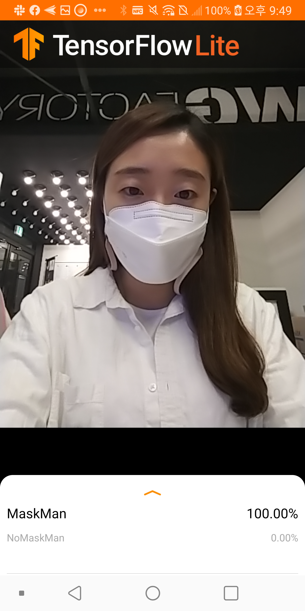

# ImageClassify_TeachableMachine_App

## TensorFlow Lite image classification Android example application 

## 이 프로젝트는 Teachable Machine 에서 학습한 결과를 Android App에서 실행할 수 있습니다. 🚀
- 1️⃣  Teachable Machine 에서 이미지 학습
- 2️⃣  학습된 결과 파일 TF Lite와 label.txt 파일 다운로드
- 3️⃣  Android APK 설치 or Android Studio Project 파일을 Clone 받아서 직접! 업로드 
    - 💙 [APK 바로 다운로드 링크!](https://www.dropbox.com/s/bpo1og78f4f75gs/ImageClassify_TM_App.apk?dl=1)
- 4️⃣  이미지 분류가 잘 수행되는지 확인!
- 5️⃣  현재는 전면 카메라 버전!

## 출처
- https://github.com/mstale007/Teachable_Machine_Mobile
- https://github.com/tensorflow/examples/tree/master/lite/examples/image_classification/android

## 수정 사항 및 앞으로 추가될 사항
- 1️⃣  원본 프로젝트를 기반으로 Kotlin 소스로 부분 변경
- 2️⃣  전면/후면 카메라 스위치 버튼 추가 예정

## 결과

